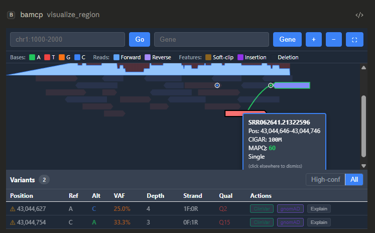

# BAMCP

**Interactive BAM/CRAM variant visualization for AI assistants via the Model Context Protocol**

[](https://github.com/RTrentJones/BAMCP/actions/workflows/ci.yml)
[](https://modelcontextprotocol.io)
[](https://python.org)
[](LICENSE)

BAMCP brings IGV-style alignment visualization directly into your AI conversations. Browse BAM/CRAM files, inspect variant evidence, and navigate genomic regions—all through natural language interaction with Claude or other MCP-enabled assistants.

<p align="center">
  
</p>

---

## Table of Contents

- [Why BAMCP?](#why-bamcp)
- [Features](#features)
- [Architecture](#architecture)
- [Installation](#installation)
- [Usage](#usage)
- [Tools Reference](#tools-reference)
- [Configuration](#configuration)
- [Implementation Details](#implementation-details)
- [Development](#development)
- [Roadmap](#roadmap)
- [Contributing](#contributing)
- [License](#license)

---

## Why BAMCP?

Existing genomics MCP servers (bio-mcp-samtools, AWS HealthOmics MCP) provide command-line operations but return text/JSON. **BAMCP is the first to leverage the [MCP Apps Extension](https://github.com/modelcontextprotocol/ext-apps) to render interactive visualizations inline.**

| Feature | CLI-based MCPs | BAMCP |
|---------|---------------|-------|
| Read BAM/CRAM files | ✅ | ✅ |
| Coverage statistics | ✅ | ✅ |
| **Interactive visualization** | ❌ | ✅ |
| **Variant browsing UI** | ❌ | ✅ |
| **Pan/zoom navigation** | ❌ | ✅ |
| **Inline in chat** | ❌ | ✅ |

---

## Features

- **Alignment Viewer** — Visualize reads with color-coded mismatches, insertions, deletions, and soft clips
- **Coverage Track** — Real-time depth of coverage across the viewing window
- **Variant Highlighting** — Automatic detection and highlighting of positions with non-reference alleles
- **Region Navigation** — Jump to coordinates, genes, or specific variants
- **Format Support** — BAM, CRAM (with reference), and indexed remote files (HTTP/S3)
- **Canvas Rendering** — High-performance visualization of thousands of reads via HTML5 Canvas
- **Multiple Transports** — stdio, SSE, and Streamable HTTP
- **OAuth 2.0 Authentication** — Optional token-based auth for network deployments
- **Docker Ready** — Production and development Docker images with compose profiles

---

## Architecture

```
┌─────────────────────────────────────────────────────────────────────────────┐
│                        MCP Client (Claude, Cursor, etc.)                    │
└─────────────────────────────────┬───────────────────────────────────────────┘
                                  │
                                  │ MCP Protocol (JSON-RPC over stdio/SSE/HTTP)
                                  ▼
┌─────────────────────────────────────────────────────────────────────────────┐
│                       BAMCP MCP Server (Python + FastMCP)                    │
│                                                                             │
│  ┌─────────────────┐  ┌─────────────────┐  ┌─────────────────────────────┐  │
│  │                 │  │                 │  │                             │  │
│  │  pysam Layer    │  │  Tool Handlers  │  │  UI Resource Provider       │  │
│  │                 │  │                 │  │                             │  │
│  │  • AlignmentFile│  │  • browse_region│  │  • ui://bamcp/viewer        │  │
│  │  • fetch()      │  │  • get_variants │  │  • text/html+mcp            │  │
│  │  • pileup()     │  │  • get_coverage │  │  • Sandboxed iframe content │  │
│  │  • CRAM support │  │  • list_contigs │  │                             │  │
│  │                 │  │  • jump_to      │  │                             │  │
│  └─────────────────┘  └─────────────────┘  └─────────────────────────────┘  │
│                                                                             │
│  ┌─────────────────┐  ┌─────────────────────────────────────────────────┐  │
│  │  Auth (opt-in)  │  │  Config (env vars)                              │  │
│  │  • OAuth 2.0 AS │  │  • Transport, host, port                        │  │
│  │  • Token mgmt   │  │  • Reference path, read limits                  │  │
│  │  • Client reg   │  │  • Auth settings                                │  │
│  └─────────────────┘  └─────────────────────────────────────────────────┘  │
└─────────────────────────────────────────────────────────────────────────────┘
```

### Data Flow

```
User: "Show me reads at chr17:7577000-7577500 in tumor.bam"
                              │
                              ▼
                    ┌─────────────────┐
                    │  MCP Client     │
                    │  (Claude)       │
                    └────────┬────────┘
                             │ tools/call: browse_region
                             ▼
                    ┌─────────────────┐
                    │  BAMCP Server   │
                    │                 │
                    │  1. Parse region│
                    │  2. pysam.fetch │
                    │  3. Serialize   │
                    │  4. Return UI   │
                    └────────┬────────┘
                             │ CallToolResult with ui/resourceUri
                             ▼
                    ┌─────────────────┐
                    │  MCP Client     │
                    │  renders iframe │
                    └────────┬────────┘
                             │ postMessage: init with read data
                             ▼
                    ┌─────────────────┐
                    │  Canvas UI      │
                    │                 │
                    │  1. Parse reads │
                    │  2. Pack rows   │
                    │  3. Render      │
                    └─────────────────┘
```

---

## Installation

### Prerequisites

- Python 3.10+
- [pysam](https://pysam.readthedocs.io/) (requires htslib)

### From PyPI (coming soon)

```bash
pip install bamcp
```

### From Source

```bash
git clone https://github.com/RTrentJones/BAMCP.git
cd BAMCP
python -m venv venv
source venv/bin/activate  # or `venv\Scripts\activate` on Windows
pip install -e ".[dev]"
```

### Docker

```bash
# Build production image
docker compose --profile prod build

# Run production server (SSE on port 8000)
docker compose --profile prod up

# Run tests in Docker
docker compose --profile dev run --rm test
```

### MCP Client Configuration

#### Claude Desktop (stdio)

Add to `~/.config/claude/claude_desktop_config.json`:

```json
{
  "mcpServers": {
    "bamcp": {
      "command": "python",
      "args": ["-m", "bamcp"],
      "env": {
        "BAMCP_REFERENCE": "/path/to/hg38.fa"
      }
    }
  }
}
```

#### Claude Desktop (SSE — network)

```json
{
  "mcpServers": {
    "bamcp": {
      "url": "http://localhost:8000/sse"
    }
  }
}
```

#### Cursor / VS Code

```json
{
  "mcpServers": {
    "bamcp": {
      "command": "uvx",
      "args": ["bamcp"]
    }
  }
}
```

---

## Usage

### Browse a Region

> "Show me the reads at chr17:7577000-7577500 in /data/tumor.bam"

The assistant will call `browse_region` and render an interactive alignment viewer inline.

### Jump to a Position

> "Jump to position 7674220 on chr17 in my BAM"

Centers the viewer on a specific position with a configurable window size.

### Inspect a Variant

> "What's the evidence for the variant at chr7:140453136 in my sample?"

BAMCP will center on the position and highlight reads supporting reference vs. alternate alleles.

### Get Coverage Stats

> "What's the average coverage across TP53 in my exome?"

Returns coverage statistics without visualization.

### List Available Chromosomes

> "What contigs are in this BAM file?"

---

## Tools Reference

| Tool | Description | Required Args | Optional Args |
|------|-------------|---------------|---------------|
| `browse_region` | View aligned reads with interactive UI | `file_path`, `region` | `reference` |
| `get_variants` | Detect and return variants in a region | `file_path`, `region` | `reference`, `min_vaf`, `min_depth` |
| `get_coverage` | Calculate depth statistics | `file_path`, `region` | `reference` |
| `list_contigs` | List chromosomes in BAM/CRAM header | `file_path` | `reference` |
| `jump_to` | Jump to a specific genomic position | `file_path`, `position` | `contig`, `window`, `reference` |

### Region Format

Regions can be specified as:
- `chr1:1000-2000` — Standard format
- `chr1:1,000-2,000` — Commas allowed
- `1:1000-2000` — Without "chr" prefix (depends on BAM header)

---

## Configuration

### Core Settings

| Environment Variable | Description | Default |
|---------------------|-------------|---------|
| `BAMCP_REFERENCE` | Path to reference FASTA (required for CRAM) | None |
| `BAMCP_MAX_READS` | Maximum reads to fetch per region | `10000` |
| `BAMCP_DEFAULT_WINDOW` | Default viewing window size (bp) | `500` |
| `BAMCP_MIN_VAF` | Minimum variant allele frequency to report | `0.1` |
| `BAMCP_MIN_DEPTH` | Minimum depth for variant calls | `10` |
| `BAMCP_MIN_MAPQ` | Minimum mapping quality filter | `0` |

### Transport Settings

| Environment Variable | Description | Default |
|---------------------|-------------|---------|
| `BAMCP_TRANSPORT` | Transport mode: `stdio`, `sse`, `streamable-http` | `stdio` |
| `BAMCP_HOST` | HTTP bind address | `0.0.0.0` |
| `BAMCP_PORT` | HTTP port | `8000` |

### Authentication Settings

| Environment Variable | Description | Default |
|---------------------|-------------|---------|
| `BAMCP_AUTH_ENABLED` | Enable OAuth 2.0 auth (`true`/`false`) | `false` |
| `BAMCP_ISSUER_URL` | OAuth issuer URL | `http://localhost:8000` |
| `BAMCP_RESOURCE_SERVER_URL` | OAuth resource server URL | `http://localhost:8000` |
| `BAMCP_REQUIRED_SCOPES` | Comma-separated required scopes | None |
| `BAMCP_TOKEN_EXPIRY` | Access token lifetime (seconds) | `3600` |

---

## Implementation Details

### Why Canvas over React?

React's virtual DOM reconciliation struggles with thousands of elements. Genomic regions typically contain 1,000-10,000+ reads:

| Approach | Max Reads | DOM Nodes | Frame Rate |
|----------|-----------|-----------|------------|
| React/SVG | ~500 | O(n) | Degrades |
| Canvas 2D | ~10,000 | O(1) | 60fps |
| WebGL | ~100,000+ | O(1) | 60fps |

BAMCP uses Canvas 2D for the rendering layer with vanilla JS for controls.

### Read Packing Algorithm

Reads are packed into rows using a greedy algorithm:

```
For each read (sorted by start position):
    Find first row where read.start > row.end
    If found: add to that row
    Else: create new row
```

This minimizes vertical space while preventing overlaps.

### Variant Detection

BAMCP performs simple pileup-based variant detection:

1. Count bases at each position from aligned reads
2. Calculate variant allele frequency (VAF) = alt_count / total_depth
3. Report positions where VAF >= threshold and depth >= minimum

This is intentionally basic—for production variant calling, use dedicated tools (GATK, DeepVariant, etc.).

### CRAM Support

CRAM files require a reference FASTA for decoding. Set `BAMCP_REFERENCE` or pass `reference` to each tool call.

---

## Development

### Project Structure

```
BAMCP/
├── src/
│   └── bamcp/
│       ├── __init__.py
│       ├── __main__.py       # Entry point (transport selection)
│       ├── server.py         # FastMCP server setup
│       ├── tools.py          # Tool handlers
│       ├── parsers.py        # pysam wrappers
│       ├── resources.py      # UI resource provider
│       ├── config.py         # Environment-based configuration
│       ├── auth.py           # OAuth 2.0 authorization server
│       └── static/
│           └── viewer.html   # Bundled alignment viewer UI
├── tests/
│   ├── conftest.py
│   ├── create_fixtures.py    # Generate test BAM/FASTA files
│   ├── test_parsers.py
│   ├── test_tools.py
│   ├── test_server.py
│   ├── test_config.py
│   ├── test_auth.py
│   ├── test_resources.py
│   ├── test_integration.py
│   ├── test_docker.py
│   ├── fixtures/
│   └── e2e/
│       ├── conftest.py
│       └── test_viewer_e2e.py
├── docker/
│   ├── entrypoint.sh
│   └── healthcheck.py
├── .github/
│   └── workflows/
│       ├── ci.yml
│       └── release.yml
├── Dockerfile              # Production (multi-stage)
├── Dockerfile.dev          # Development (with test tooling)
├── docker-compose.yml      # dev/beta/prod profiles
├── pyproject.toml
├── Makefile
├── README.md
├── CONTRIBUTING.md
├── SECURITY.md
└── LICENSE
```

### Running Locally

```bash
# stdio mode (default)
python -m bamcp

# SSE mode (network)
BAMCP_TRANSPORT=sse python -m bamcp

# Streamable HTTP mode
BAMCP_TRANSPORT=streamable-http python -m bamcp

# With MCP inspector
npx @modelcontextprotocol/inspector python -m bamcp
```

### Running Tests

```bash
# Unit + integration tests
make test

# With HTML coverage report
make coverage

# E2E tests (requires Playwright)
make test-e2e

# Tests in Docker
make docker-test
```

### Code Style

```bash
# Check
make lint

# Auto-format
make format

# Type check
make typecheck
```

Tools: [ruff](https://github.com/astral-sh/ruff) (linting + formatting), [mypy](https://mypy.readthedocs.io/) (type checking).

### Docker Development

```bash
# Build all images
make docker-build

# Run tests in container
docker compose --profile dev run --rm test

# Run linting in container
docker compose --profile dev run --rm lint

# Start beta server
docker compose --profile beta up

# Start production server (with auth)
docker compose --profile prod up
```

---

## Roadmap

- [x] **v0.1** — Core viewer with BAM support, Canvas renderer, variant detection
- [x] **v0.2** — CRAM support, coverage track, MCP Apps UI resource
- [x] **v0.3** — FastMCP migration, SSE/HTTP transports, OAuth 2.0
- [x] **v0.4** — Docker infrastructure (prod/dev/beta), CI/CD
- [ ] **v0.5** — MCP Apps SDK integration (`updateModelContext`, `callServerTool`, app-only tools)
- [ ] **v0.6** — ClinVar + gnomAD API clients
- [ ] **v0.7** — Evaluation harness (ACMG scaffolds, failure mode detection, ground truth benchmarks)
- [ ] **v0.8** — Gene annotation track (RefSeq)
- [ ] **v0.9** — VCF overlay, multi-sample comparison
- [ ] **v1.0** — Stable release

---

## Related Projects

- [bio-mcp-samtools](https://github.com/bio-mcp/bio-mcp-samtools) — CLI-based samtools MCP wrapper
- [igv.js](https://github.com/igvteam/igv.js) — JavaScript genome visualization library
- [pysam](https://github.com/pysam-developers/pysam) — Python interface to htslib
- [MCP Apps Extension](https://github.com/modelcontextprotocol/ext-apps) — UI extension for MCP

---

## Contributing

Contributions are welcome! Please see [CONTRIBUTING.md](CONTRIBUTING.md) for guidelines.

1. Fork the repository
2. Create a feature branch (`git checkout -b feature/amazing-feature`)
3. Commit your changes (`git commit -m 'Add amazing feature'`)
4. Push to the branch (`git push origin feature/amazing-feature`)
5. Open a Pull Request

---

## License

MIT License — see [LICENSE](LICENSE) for details.

---

## Acknowledgments

- The [Model Context Protocol](https://modelcontextprotocol.io) team at Anthropic
- [MCP-UI](https://github.com/idosal/mcp-ui) for pioneering interactive MCP interfaces
- The [pysam](https://github.com/pysam-developers/pysam) and [htslib](https://github.com/samtools/htslib) maintainers
- [IGV](https://igv.org/) for inspiration on genomics visualization

---

<p align="center">
  <b>BAMCP</b> — BAM files + Model Context Protocol<br>
  <sub>Built for the computational biology community</sub>
</p>
